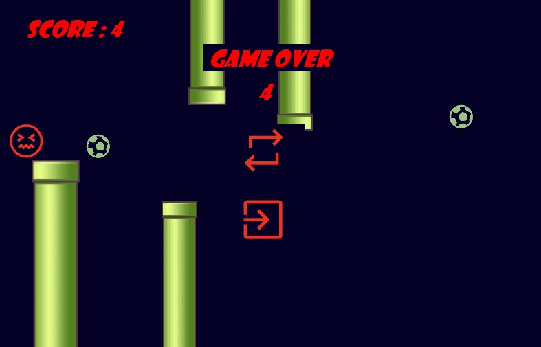

# 🎮 Hungry Player
---
Hungry Player is a 2D game ,You control a hungry little character who must eat all the floating balls to gain points — but beware of the deadly pipes and the ground!

---

## 🧩 Features

- 🕹️ **Smooth gameplay physics** (gravity, jump, collision detection)
- 🎯 **Score system** — collect balls to increase your score
- 🚧 **Dynamic obstacles** — moving upper and lower pipes
- 🔄 **Restart & Exit buttons** with interactive UI
- ⚡ **Automatic speed reset** and object repositioning after restart
- 🎨 **WinForms-based graphics**, no external game engine required

---

## 🕹️ Controls

| Key | Action |
|-----|---------|
| **Spacebar** | Make the player jump |
| **Restart Button** | Restart the game after Game Over |
| **Exit Button** | Exit the game |

---

## 📸 Screenshots

| Gameplay --Game Over |
|----------------------|
|  |

---
## 🧠 How It Works

The game loop is handled by a **Timer** event `gameTimeEvent`.  
Each tick:
- Moves the **player** down by gravity.
- Scrolls **pipes** and **balls** to the left.
- Detects **collisions** with pipes or boundaries.
- Increments **score** when a ball is collected.
- Calls `EndGame()` if the player hits a pipe or falls out of bounds.

When the game ends:
- The timer stops.
- The **Restart** and **Exit** buttons appear.
- The **Final Score** is displayed.

---

## 🧩 Game Logic Overview

```text
Start Game
   ↓
Player falls with gravity
   ↓
Player jumps when Space is pressed
   ↓
Collect balls → +1 Score
   ↓
Avoid pipes & screen edges
   ↓
If collision → End Game
   ↓
Display final score & restart option
```

### 👨‍💻 Author
Developed with ❤️ in C# by **Marouan El Yassini**
